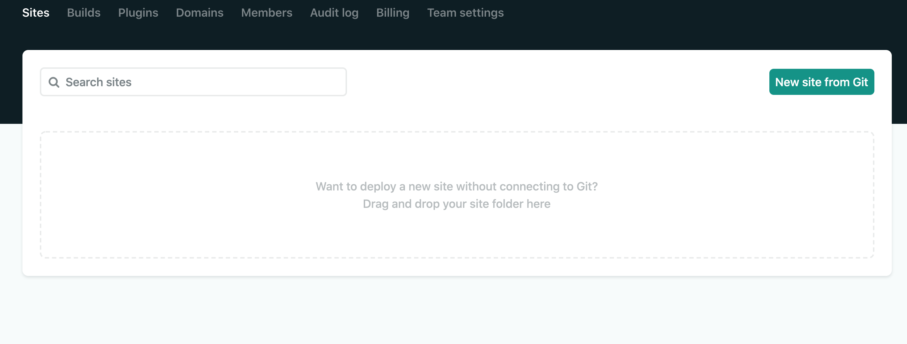

One of the great advantages of deploying your Gatsby website through Netlify is free hosting.
Today you’ll learn how to deploy your own Gatsby website to Netlify and have that free hosting too. Let’s get started.

## Assumptions

You have an exiting Gatsby project repository on one of the three sources:

1. GitHub
2. GitLab
3. BitBucket

## What is Gatsby JS?

Simply put, Gatsby is a static site generator. "What's that?", you ask? The static site part of this means that Gatsby will produce static HTML files that will be loaded onto a server. This works differently than how a lot of websites work, where you visit a website and it has to query a database or do some programming on the server itself in order to serve your web pages. Gatsby breaks that convention and has all of the stuff pre-configured ahead of time, and just serves that up. It's important to point out that static sites do not mean they aren't interactive or dynamic. We can load JavaScript into the HTML files that Gatsby serves, as well as, make API calls and build incredibly rich and immersive sites, as we've done with the Nyxo.app. While the Nyxo.app has been built on top of Gatsby, it still has things like authentication and fetching data from different data sources.
Let's talk about some of the benefits of a static site. Speed, SEO, and security are some of the perks of using Gatsby. Not only are Gatsby sites made to be blazing fast, but they are very secure since there is no database or server. In addition, static sites improve your SEO since crawlers can find the content much easier. Speed is very important for a website. It's so important that Google has made it an actual ranking factor. How about that?
Want to get started with Gatsby? We found a nice [tutorial](https://www.gatsbyjs.org/tutorial/) to get your Gatsby ball rolling.

## What is Netlify?

Netlify works great with Gatsby. Netlify CMS is an open-source content management system for your Git workflow. You can use it with Gatsby to create faster, more flexible web projects. Your project is stored in your Git repository for easier versioning, multi-channel publishing, and the option to handle content updates directly in Git.
Every time you push your code to Git, it builds in the Git repository and builds a preview branch, where you can share your latest work, live, with others. So when you have worked hard on that project and need to show your manager the latest changes, take that Netlify link and send it to them. They'll see everything you just pushed to your Git repository.
Not to forget, with Netlify you can host your Gatsby website for free. Yep, for free. I won't go into full details about Netlify. That could be a blog post on its own, but [here](https://www.gatsbyjs.org/docs/deploying-to-netlify/) is the documentation on getting started with Netlify and hosting your website. You're welcome.
Want to read more about Netlify? Click [here](https://www.netlify.com/).

## Deploying your Gatsby Website to Netlify

Now that you know what Gatsby and Netlify are all about, let's get this party started.

### Login to Netlify

Don't have a Netlify account? No problem. Simply login through your GitHub, GitLab, BitBucket, or sign up with your email account.
For this tutorial, I'll sign into Netlify with my GitHub account.
You should see the following:

Here you can deploy your Gatsby site in two ways:

1. Click "New site from Git" at the top right of the page.
2. Drag your public folder from your Gatsby project and place it where it says "Drag and drop your site folder here".
   For this tutorial, I will click the **"New site from Git"** at the top right of the page.

### "Create a new site"

You will need to choose your Git provider. So choose the provider where your Gatsby repository is. For me, it will be GitHub.
You may be asked to authorize Netlify before you can select the repository you want to deploy to Netlify.

### "Pick a repository"

From here, select the repository you that want to deploy to Netlify. You should see a list of your repositories in this section.

### "Build options and deploy!"

Have a look at the generated information. If everything looks good, click "Deploy site" and let the magic begin.

### Look Ma! My Gatsby project is deployed to Netlify!

Once you've clicked "Deploy site", you will see an active Netlify deploy status.
If you build fails, don't worry. You can find out the reason why it failed by looking at the deploy log under the **Production deploys** section.

#### Unique Web Address

Every deployed project on Netlify has a unique URL. Most often the combination of words doesn't make sense, but they can provide you with a link that you can share with friends, co-workers, family, and so on. This way you can show off that Gatsby project you've worked on for days.

One such example of the unique Netlify URL is: [https://hungry-elion-3babd3.netlify.app/](https://hungry-elion-3babd3.netlify.app/)

##### What If I Update My Repository?

Netlify will take care of everything for you. Because your repository is connected to Netlify, whenever you update your repo, the changes will be picked up by Netlify. How cool is that?

### Helpful Hints

If you happen to be deploying a Gatsby website that uses AWS Amplify, make sure your `aws-exports.js` file isn't included in the `.gitignore` file. Otherwise, your project won't deploy and will fail.
The Amplify documentation is not specific about how you should maintain your builds when using the Amplify Console, but there has been success by generating your aws-exports file when you run a successful amplify push command.

For more information on this solution, please click [here](https://stackoverflow.com/questions/59708481/aws-amplify-deploy-failure-due-to-aws-exports).

### Is That All?

Yep! It's that easy! In a matter of minutes, you can have your Gatsby project deployed to Netlify with a shareable link.
