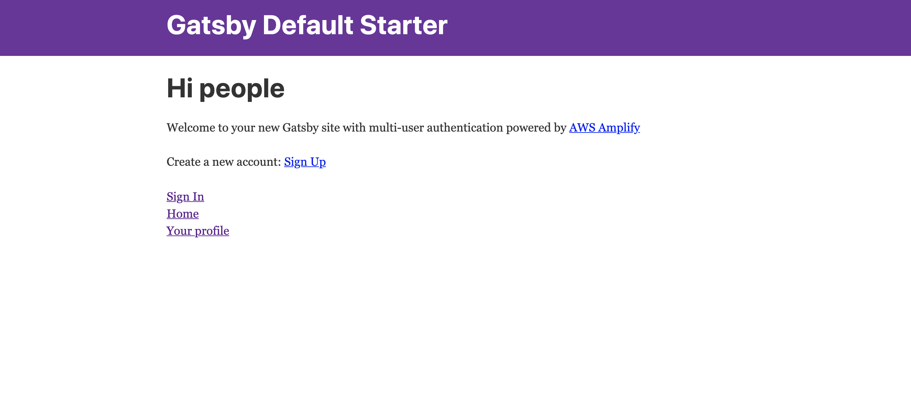

Authentication. We need it to access our email, banking, and the many website accounts we have. Authentication is the act of proving one’s identity in order to access their personal account information while online. In this blog post you’ll learn how to add authentication to your Gatsby website using the AWS (Amazon web service) tools called Cognito and Amplify.

This is the second part of a three-part blog series on building products with Gatsby, Netlify, and AWS Amplify. The next blog post of this series will discuss using Contentful content with your Gatsby website.

## What is Amplify?

AWS Amplify is a development platform for building secure, scalable mobile and web applications. With Amplify you can do the following:

1. Authenticate users
2. Securely store data
3. Authorize selective access to data
4. Integrate machine learning
5. Analyze application metrics
6. Execute server-side code

Scaling becomes easy because it covers the complete mobile application development workflow, including version control, testing, and production deployment.

Advantages include simplified data, offline synchronization, no servers to manage, good security controls.

For more information about Amplify, please view their <a href="https://docs.amplify.aws/" rel="noopener">documentation</a>.

## Creating a New Project with Amplify Authentication

Kicking things off, have a look at this GitHub repository. It’s a Starter Project with Authentication with Gatsby & AWS Amplify.

[https://github.com/hello-nyxo/gatsby-auth-amplify-with-typescript](https://github.com/hello-nyxo/gatsby-auth-amplify-with-typescript).

We will use this repository as a reference for this blog post.

1. Create the project

```bash
gatsby new gatsby-amplify-auth https://github.com/hello-nyxo/gatsby-auth-amplify-with-typescript
```

2. Change into the new directory.

```bash
cd gatsby-amplify-auth
```

3. Install the necessary packages.

```bash
yarn
# or
npm install
```

4. Install and configure the AWS Amplify CLI.

```bash
npm install -g @aws-amplify/cli

amplify configure
```

To see a video of how to configure the CLI, click [here](https://www.youtube.com/watch?v=fWbM5DLh25U).

5. Create a new AWS Amplify Project

```bash
amplify init
```

Let's walk through the following steps:

- Enter a name for the project **YOURPROJECTNAME**
- Enter a name for the environment **master**
- Choose your default editor: **Visual Studio Code (or your editor of choice)**
- Choose the type of app that you're building **javascript**
- What javascript framework are you using **react**
- Source Directory Path: **src**
- Distribution Directory Path: **public**
- Build Command: npm run-script **build**
- Start Command: npm run-script **develop**

6. Push the updated project configuration to AWS.
   It will deploy a CloudFormation template that has an Amazon Cognito resource that enables user authentication.

```bash
amplify push
```

7. Let's run the code.

```bash
gatsby develop
```

The main goal is to get the file `aws-exports.js` file in your `src` directory.

**Note**: After running `gatsby develop`, if you get the error message, **“UNHANDLED REJECTION Cannot create as TypeComposer the following value: Date.”** Try deleting the `package-lock.json` file and `node_modules` folder. Use `yarn` instead of `npm install` from step 3.

After running your project, you should see the following screen.



Now you can sign in to your existing account or sign up for a new one. Once you sign in to your account, you can go to your profile page where you can see your account email address and username.

For more information about Gatsby and Amplify authentication, please view their [documentation](https://github.com/hello-nyxo/gatsby-auth-amplify-with-typescript).

## Adding Amplify Authentication to an Existing Project

For already existing projects, you will need to perform steps 4-7 from the _Creating a New Project with Amplify Authentication_ section of this blog.

Once that is complete, in your pages folder create a new file called `app.tsx`. Add this code to that file. Don’t like the name app.tsx? Change it to anything you like.

```javascript
//app.tsx

import React from "react"
import { Router } from "@reach/router"
import Layout from "../components/layout"
import Details from "../components/Details"
import Login from "../components/Login"
import SignUp from "../components/SignUp"
import Home from "../components/Home"
import PrivateRoute from "../components/PrivateRoute"
import Amplify from "aws-amplify"
const config = require("../aws-exports").default

const App = () => {
  Amplify.configure(config)

  return (
    <Layout>
      <Router>
        <PrivateRoute path="/app/home" component={Home} />
        <PrivateRoute path="/app/details" component={Details} />
        <Login path="/app/login" />
        <SignUp path="/app/signup" />
      </Router>
    </Layout>
  )
}

export default App
```

This file brings together the necessary components for your login, registration, and profile (details) pages. As you can see from the file, there are components you’ll need to create. Specifically the `Login`, `SignUp`, `Details`, and `PrivateRoute` components. For the source code to these components, please see the GitHub repository mentioned at the top of this blog post. You’ll place those in your components folder. The code within the components is pretty self-explanatory.

## So what exactly happened here?

In short, a private route was created and within that private route the login, registration, post-login pages (Ie: Details page) were displayed. When a user goes to any of these pages, Amplify confirms if the user is logged in or not, using the Amplify auth functionality, and redirects accordingly.

Still need more information for Amplify Authentication? Check out this [link](https://docs.amplify.aws/lib/auth/getting-started/q/platform/js).

## Conclusion

AWS Amplify is a very secure way to have users log in and signup to your website. In this blog post, you learned how to create a new website with the Amplify authentication provided out of the box. For those with an already existing website, you learned how to create a private route which displayed the login, registration, and post-login pages to your users.
