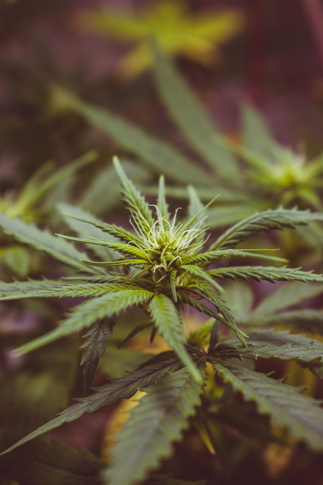

While cannabis is classified as an illegal drug in many parts of the world, the plant has some significant therapeutic properties. It can be used for many medical purposes, and some patients report it is indeed the best symptom alleviator available for them. Despite being illegal for most users, many people choose to utilize cannabis as a relaxing drug or even sleep aid. Is cannabis good for your sleep or not? Let's find out what science has to say about getting high and getting sleep!

## How Cannabis Works in the Brain

Some molecules in cannabis have chemical structures similar to the brain's own chemicals (for instance, delta-9 tetrahydrocannabinol in THC and the brain's anandamide). The similarity in the structure allows cannabinoids to attach to cannabinoid receptors on neurons. As the receptors interact with several neurotransmitters and neuromodulators, cannabinoids transform the activity of these neurons. This way, they end up altering various mental and physical processes. The neural communication network involved in these processes is also known as the endocannabinoid system. It plays a critical role in the nervous system's functioning and may also cause changes in sleep behavior and sleep's neural dynamics.

## Is Cannabis Good or Bad for Your Sleep?

Cannabis has many relaxing and passivating effects. Due to its evident relaxation effects, an increasing amount of people have turned to cannabis and cannabinoids as a means for alleviating anxiety and insomnia symptoms, and some even suggest it helps them sleep through the night. Singular subjective reports typically highlight the pros of using cannabis, but what does science have to say about it? There is currently limited scientific research on cannabis and sleep, even though many individuals often report using cannabis as a sleeping aid. Especially studies that would include objective measurements of sleep are sparse.

[In one questionnaire study](https://www.ncbi.nlm.nih.gov/pubmed/31169378) with an adequate sample size of 200 college students, using cannabis as a sleep aid predicted longer sleep duration, less time spent awake after falling asleep, but greater next-day fatigue.

[One review article](https://www.ncbi.nlm.nih.gov/pubmed/31120284) gathered several small studies and concluded that cannabinoids could, in fact, improve sleep quality, reduce sleep disturbances, and decrease sleep onset latency (time falling asleep). However, they also noted that the studies included in their review typically had small sample sizes and only examined sleep as a secondary outcome in the context of some illness. Additionally, only relatively few studies used either validated questionnaires or objective measurements (such as sleep EEG). The authors concluded that studies should be more ambitious and that they should also investigate the differences between THC (delta-9 tetrahydrocannabinol) and CBD (cannabidiol). They also pointed out that no one knows what long-term adverse effects cannabinoid use might have.

While insomnia may be quite diverse in its manifestation, some studies suggest that cannabis may alleviate insomnia symptoms, [as suggested by a recent literature review](https://www.ncbi.nlm.nih.gov/pubmed/28349316). Especially CBD may have therapeutic potential, while THC may ease falling asleep but seems to impair sleep quality, especially long-term. As a novel research path, some studies have also investigated the role of cannabinoids in treating obstructive sleep apnea. These studies have found that synthetic cannabinoids have short-term benefits for sleep apnea. This may sound surprising, but the effect is likely due to the modulatory effects on serotonin-mediated apneas. [In other studies](https://www.ncbi.nlm.nih.gov/pmc/articles/PMC4165471/), CBD has shown promising results for REM sleep behavior disorder and excessive daytime sleepiness. These studies also suggest that synthetic cannabinoids (such as nabilone) may reduce nightmares associated with PTSD and improve sleep among patients with chronic pain.

[One review article](https://pubmed.ncbi.nlm.nih.gov/26346395/) gathered objective measurements of cannabis use. Based on five different studies using sleep EEG, the writers concluded that using low THC cannabis for intoxication shortened sleep onset latency (time falling asleep) and increased deep sleep and total sleep. However, at the same time, it decreased the amount of REM sleep. In contrast, chronic use, or using high THC amounts, had merely negative effects resulting in suppression of deep sleep, decreased REM sleep, and longer sleep onset latency.

## What Should You Make Out of This?

Based on the current state of scientific research, it can be concluded that cannabis and cannabinoids may alleviate some symptoms relating to neurological disorders, including some sleep disorders. It is wise to remember that it does this by altering brain functioning, and it is unknown what long-term effects this alteration might have. It seems that subjective experiences support the sleep-inducing effects of cannabis and cannabinoids, at least in some populations.

However, objective measurements of sleep indicate less REM sleep in those who overindulge in recreational use of cannabis. The effect is, therefore, somewhat similar to what alcohol does to your sleep. Chronic cannabis use also suppresses deep sleep decreasing overall sleep quality even more.

