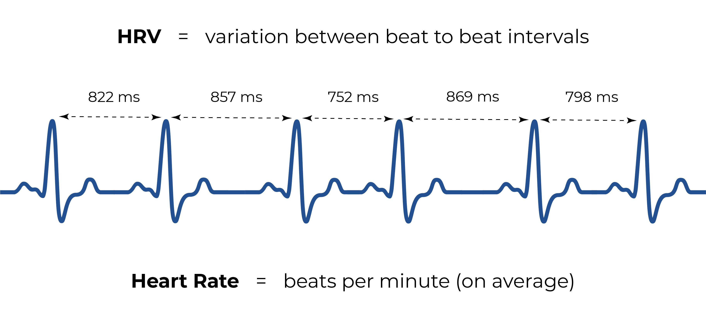

Most sleep and activity trackers measure heart rate. Many also report something called "heart rate variability" or HRV. What on earth is that, and what are HRV readings supposed to tell you? What lies behind the marketing BS? Let's find out!

## What Is Heart Rate Variability?

As odd as it may sound, your heart doesn't beat steadily. There is slight variability in the rhythm between every beat. Sometimes the interval between beats is a bit shorter, sometimes longer. We are talking about milliseconds here so you won't notice the variation yourself, but modern heart rate monitors will. Your tracker's HRV reading reflects the average variation in your heartbeat interval in milliseconds over a specified time segment (often 5 minutes in continuous HRV measurements).

Okay, but so what? Your heart is a living organ, not a machine. No surprise, there is some fluctuation in the rhythm, right? The thing is that it's not just some random variation. HRV seems to react to changes in your autonomic nervous system activity.

## HRV Is a Physiological Indicator of Stress

The autonomic nervous system (ANS) controls many unconscious bodily functions. It can be divided into two branches: the "fight or flight" system (sympathetic nervous system) and the "rest and digest" system (parasympathetic nervous system). The "fight or flight" state arises during stressful situations that require high alertness. During this state, HRV gets lower (that is, less variation in the beat to beat intervals). "Rest and digest" is the opposite state. It occurs when no outside stressors are present, especially during rest and sleep. During this state, HRV gets higher (more variability).

Essentially, this means that [HRV can be used as a physiological indicator of stress](http://doi.org/10.30773/pi.2017.08.17) and, on the other hand, recovery. Lower HRV readings indicate high stress and activity levels, whereas higher HRV is desirable during the time dedicated to rest and recovery. If your HRV readings are low even when you are resting, the chances are that something keeps your stress or alertness levels too high, and you are not recovering that well. In general, your night-time HRV should be significantly higher than during the day.

## What Are "Good" HRV Values?

The basic principle is that the higher the overall HRV is, the better. However, it's good to remember that HRV doesn't measure stress directly. It reflects the activity of the whole autonomic nervous system, and low HRV readings don't necessarily mean you are stressed. Various other factors can also affect your HRV.

Naturally, the time of day and your daily activities matters a lot. Exercising, engaging in something exiting, experiencing strong emotions, getting aroused, drinking coffee, going to work... All of these things activate your sympathetic "fight or flight" system and lower your HRV – and that is perfectly fine! It is only if your HRV score is continuously low when you should worry.

But what is "low" and when the scores are optimal? That is a much harder question. HRV scores are individual, and for instance, age, fitness level, and gender affect it significantly. Young and physically fit persons tend to have the highest HRV scores, whereas it's only natural for older people to get lower readings. That's why it makes more sense to compare the HRV scores to your previous ratings, not so much with other people. Just keep in mind that your night-time HRV should be higher than during the day.

## Should You Rely on HRV Measurements?

Measuring HRV is much more complicated than regular heart rate and requires a great deal of accuracy from the tracker device. In terms of accuracy, chest straps and other dedicated heart rate monitors provide the best results. Many wearables, such as wristbands, rings, and watches, also measure HRV, but it's not always easy to determine how reliable the readings are. ([Some, such as Oura, do provide quite convincing evidence about the accuracy of their devices.](http://doi.org/10.1088/1361-6579/ab840a)) HRV is a high-tech solution for measuring stress and recovery. I guess that it is one of the reasons why tech companies and wearable manufacturers like to hype it so much!

Let's assume that most of the time, HRV measurements are accurate enough. The more important question to me is how useful those readings really are in terms of improving your rest and recovery? There is no simple answer.

Let's imagine you discover that last night your night-time HRV was significantly lower than usual. You begin to wonder what might be the cause. If you can find a plausible explanation (work stress, alcohol use, late-night gaming, you name it) and then change your behavior, then yes, the information was useful. But sometimes it might be challenging to see the connection between HRV scores and real life. If you can't understand what the score could mean, it can be quite confusing and not helpful at all.

That being said, HRV is definitely not snake oil, but it's nothing magical either. I would think of it as an advanced activity measurement feature. It can be useful for people who are into self-optimization and are not afraid to use Google (and exercise critical thinking at times). For example, athletes who need to pay extra attention to their recovery can find HRV measurements very handy. But you can certainly live without it and still get a perfectly good rest!
