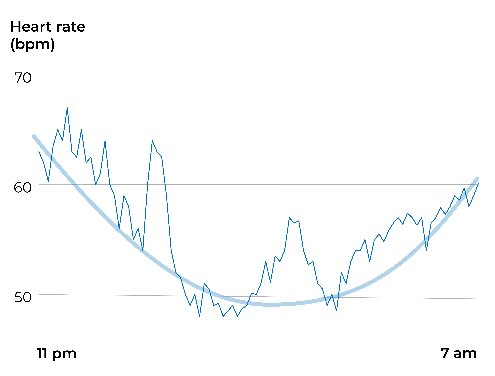

Yöllinen syke on laajalti käytetty mittari unen seurannassa, ja monet mittarit näyttävät sykekäyräsi yön ajalta. Mutta mitä se oikeastaan kertoo?

Unen ja levon aikana sykkeesi laskee. Matalampi syke kertoo, että kehosi palautuu edellisestä päivästä. Yleisesti ottaen matala leposyke on merkki hyvästä sydän- ja verisuoniterveydestä – mitä matalampi, sitä parempi. Tyypillisesti terveellä ihmisellä yöllinen syke on alimmillaan noin 50–60 lyöntiä minuutissa käyrän matalimmassa kohdassa. Sykearvot ovat kuitenkin yksilöllisiä ja siksi vaikeasti vertailtavissa. Syke nousee iän myötä, ja on aivan luonnollista, etteivät vanhemmat ihmiset saavuta samoja leposykearvoja kuin nuoremmat aikuiset. Unen ja palautumisen kannalta on järkevämpää verrata sykearvoja omiin aikaisempien öiden keskiarvoihin kuin väestön keskiarvoihin.

## Korkeampi syke viittaa huonoon uneen

Jos yöllinen sykkeesi on tavallista korkeampi, on enemmän kuin todennäköistä, että unessasi oli ongelmia sinä yönä. Useat tekijät voivat nostaa sykettäsi yön aikana.

#### Henkinen ylikuormitus

[Stressi, valppaus sekä emotionaalinen tai kognitiivinen ylikuormitus](https://nyxo.app/lesson/difficulty-falling-asleep) ovat tyypillisimpiä univaikeuksien aiheuttajia. Näissä tilanteissa jokin elämässäsi tai ympäristössäsi (olipa se työ, ihmissuhdehuolet tai videopelit) aktivoi kehosi taistele tai pakene -reaktion. Sykkeesi nousee, stressihormonitasot kohoavat ja koko kehosi valpastuu. Niin hyödyllistä kuin tämä voi olla joissain tilanteissa, illalla se tekee nukahtamisesta erittäin vaikeaa ja häiritsee vakavasti untasi. Tavallista korkeampi syke yön alussa voi viitata henkiseen ylikuormitukseen.

#### Fyysinen ylikuormitus

Fyysisellä ylikuormituksella voi olla samankaltaisia vaikutuksia kuin henkisellä ylikuormituksella. Ylikuntotila syntyy, kun henkilö harjoittelee niin kovaa, että kehon palautumiskyky ylittyy. Kohonnut yöllinen syke on yksi merkki siitä, ettei keho pysty palautumaan rasituksesta edes yön aikana. Liian myöhäisellä harjoittelulla voi olla samanlaisia vaikutuksia, jos keho ei ole täysin palautunut fyysisestä rasituksesta ennen nukkumaanmenoa. Tämä voi olla ongelma erityisesti vanhemmilla ihmisillä, sillä heidän kehonsa tarvitsee usein enemmän aikaa palautumiseen kuin nuorempien.

#### Kemialliset aineet

[Alkoholi](https://nyxo.app/lesson/alcohol-myths-and-facts), [nikotiini](https://nyxo.app/lesson/how-nicotine-affects-your-sleep) ja [kofeiini](https://nyxo.app/lesson/addicted-to-caffeine) voivat kaikki nostaa sykettäsi yön aikana ja häiritä untasi.

#### Sairaus

Jos sinulla on kuumetta, leposykkeesi on tavallista korkeampi.

#### REM-uni

REM-uni ja unennäkö voivat tilapäisesti nostaa sykettäsi aiheuttaen lyhyitä piikkejä yölliseen käyrään. Nämä piikit ovat kuitenkin täysin normaaleja eivätkä välttämättä tarkoita, että nukuit levottomasti.

## Sykemallit kertovat rytmeistäsi

Usein absoluuttisia sykearvoja tärkeämpiä ovat mallit, jotka näkyvät yöllisessä sykekäyrässäsi. Niistä voi helposti päätellä, nukutko biologisten rytmiesi mukaisesti.

Yöllinen sykkeen lasku johtuu sekä vuorokausirytmistä että varsinaisesta nukkumiskäyttäytymisestäsi (siitä, että lepäät). Optimaalinen yöllinen sykekäyrä on U:n muotoinen: syke alkaa laskea nukahtamisen jälkeen, saavuttaa matalimman tasonsa suunnilleen unen puolivälissä ja nousee sitten hitaasti heräämiseen asti. Tämä on tyypillinen malli levolliselle yölle. Käytännössä se kertoo, että menit nukkumaan rentona ja oikeaan aikaan, nukuit hyvin koko yön ja heräsit virkeänä luonnollisen herätysaikasi tienoilla.

U:n muotoinen sykekäyrä osoittaa, että vuorokausirytmisi on linjassa nukkumiskäyttäytymisesi kanssa. Biologisen kellon tahdissa eläminen on ykkösohje hyvään ja terveelliseen uneen. Vuorokausirytmin häiriöt näkyvät helposti sykemallista. Jos esimerkiksi menit nukkumaan liian myöhään, sykkeesi saattaa alkaa nousta aivan liian aikaisin aamulla. Tai jos nukuit liian vähän, käyrä saattaa olla vielä matalimmillaan herätessäsi, mikä tekee aamusta unisen painajaisen.
