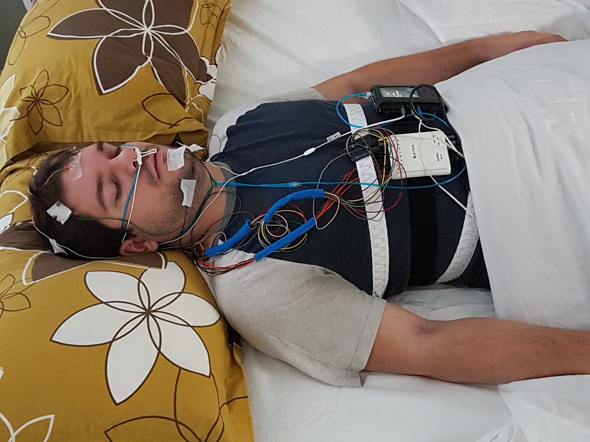

Using a wearable device is by far the most popular way to track your sleep at home. Practically every activity tracker in 2020, even the cheapest wristbands, can track your sleep. There are so many of them in the market that comparing different brands and models can be tedious and time-consuming. Manufacturers hide the technical specifications under neat-sounding buzzwords and marketing phrases. What does the tracker actually measure, and how much of the data is pure guesswork? What makes the difference between a $29 and a $299 device? This two-part guide will help to understand what you should pay attention to when looking to buy a sleep tracker, what features are the less critical, and whether more expensive is always better.

Unfortunately, sleep tracker markets are the wild west of misleading information and pseudoscientific claims. Don't get me wrong! The trackers can be very handy – you just need to be able to tell the facts from fiction. First and foremost, it is essential to understand that **consumer sleep trackers don't measure sleep directly** but estimate your sleep indirectly based on your behavior and other indirect information. That's why it is crucial to know what the devices actually measure and what they make out of the data.

## How Do Sleep Trackers Work?

Every wearable consumer-grade sleep tracker is essentially an actigraph device. They are equipped with an actimetry sensor (accelerometer) that tracks your hand movements during the day and throughout the night. Based on your activity level and the time of the day, the device estimates whether you have been awake or asleep.

This technology obviously comes with its limitations. If you sit still reading a book or watching TV before bed, the device might count this as sleep. Tracking your sleep via a movement sensor might not sound that sophisticated or compelling, which is why companies often focus their sales pitches towards more medical-sounding data sources, such as heart rate. In reality, movement is still the most relevant and most utilized data factor in customer-grade sleep trackers. It can provide surprisingly accurate estimations of your sleep-wake cycle, especially when combined with other data sources.

Even the cheapest sleep trackers use actigraphy to track the general aspects of your sleep. If the fundamental piece of hardware is essentially the same, what makes the difference between a cheap and more expensive device? Data-wise, two things matter the most: how many additional data sources are used together with motion data, and how sophisticated the algorithm is.

## Additional Data Sources

Even though body movements make up the core of sleep measurements, personal sleep trackers often use other data sources to compensate for the shortcomings and make the estimations more accurate (a method known as triangulation). What kind of data sources are used depends on the manufacturer. Here are some of the most common ones.

#### Heart Rhythm

The majority of wearable sleep trackers also measure heart rate. Heart rate patterns can correlate with sleep in multiple ways and can be used as a supplementary data source when estimating sleep duration and quality. ([You can read more about heart rate and sleep here!](https://nyxo.app/what-can-heart-rate-tell-about-your-sleep)) Some higher-end devices also measure [heart rate variability (HRV)](https://nyxo.app/heart-rate-variability-hrv-is-the-hype-justified) and some even respiratory rate (based on cardiac activity). Heart rate and cardiac activity measurements alone don't provide enough information about your sleep, but they sure can improve the accuracy of the data and are often used when estimating sleep quality.

#### Body Temperature

Your body temperature decreases during sleep, and body temperature data can be used to estimate your sleep-wake rhythms on a broader scale. However, this is not the most common feature and is typically found only in the more expensive sleep trackers.

#### Environmental Factors

Some sleep trackers also measure environmental factors such as room temperature, exposure to light, or ambient noise. Using the smartphone's microphone to measure environmental noise during the night is typical, especially for sleep tracking apps that don't require a separate tracking device (using ambient noise as the only data source is, of course, quite limiting).

## How Personal Sleep Trackers Differ From Professional Devices?

The golden standard of professional sleep tracking is polysomnography (PSG). In contrast to consumer trackers, PSG relies on electrical brain activity (EEG) as the primary data source rather than body movements. It also monitors several other bodily functions, such as heart rhythm, eye movements, and muscle activity during sleep. Wearable sleep trackers try to mimic some of these features, but the general principle between consumer-grade and medical sleep trackers is utterly different. Even though personal sleep trackers can estimate the basics, some aspects of sleep cannot be measured without monitoring brain activity directly.

## What Sleep Trackers Are Good At

Actigraphy based sleep trackers are best at detecting whether you are asleep or awake, and they are constantly getting better and better at it. They can keep track of your sleep duration and sleep-wake rhythms, making them excellent tools for detecting things such as [insufficient sleep](https://nyxo.app/lesson/do-you-sleep-enough), [sleep interruptions](https://nyxo.app/lesson/sleep-quality), circadian misalignment, [social jetlag](https://nyxo.app/lesson/social-jet-lag), and consistency issues.

## What Sleep Trackers Suck At

Personal sleep trackers can't detect [sleep stages](https://nyxo.app/lesson/sleep-stages-explained). I cannot emphasize this enough. None of the current actigraphy based trackers in the market can reliably tell whether you are in a deep, light, or REM sleep stage. Body movements (and sometimes heart rate) can change slightly based on the sleep stage, but the correlation is way too vague and inconsistent to draw any useful assumptions without actual brain activity data. Still, almost every sleep tracker manufacturer claims otherwise. Monitoring sleep stages with a wristwatch and making assumptions of your sleep quality based on those is pure snake oil. Don't fall for that! Maybe in the future, consumer EEG devices become more available, enabling new possibilities in personal sleep tracking, but for now, we'll have to settle for what we have.

## Should You Trust Your 'Sleep Score'?

Sleep trackers usually try to measure your [sleep quality](https://nyxo.app/lesson/sleep-quality) in one way or another. A typical approach is to provide a 'sleep score' or some other metric that is supposed to tell you how well you slept last night. How reliable the sleep quality assessment is, depends solely on how it is calculated and which data sources are used.

Founding the score mainly on night-time heart rate patterns, sleep interruptions, and bedtime consistency can result in reliable estimates of your sleep quality. However, some devices tend to lean heavily on sleep stages when assessing sleep quality. Sleep stages do affect your sleep quality, but as we already discussed, measuring sleep stages without brain data is questionable at best. Such estimations are not nearly as trustworthy and are subject to various biases and artifacts. In short, learn how the sleep score is calculated before trusting it blindly.

## Are Sleep Trackers Useful?

Sleep trackers can reveal a lot from your sleep. They provide a unique window to your sleeping habits and can genuinely help you sleep better – as long as you can interpret the data. Just remember that tracking your sleep alone doesn't make any difference. The real change only comes from within.

#### Sleep Tracker Buyer's Guide Pt. 2 coming soon!
