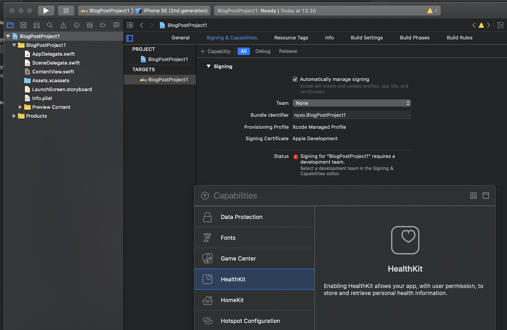

## Swift and SwiftUI for Data Science

Swift offers powerful tools for fast and simple iOS development. Lately Swift's very own SwiftUI has made it very easy to create simple interfaces that can be used for quick testing with minimal development. One of the fields that can benefit from these aspects, is the field of Data Science, where getting to a working prototype can take tons of development hours and you want to minimize the hours you spend on designing features that might not see the daylight at all. Apple has made enormous effort to make both Machine Learning and implementing simple UIs easy with Swift.

This blog post is part of a series that gives insight on how Swift can be used to fetch and preprocess HealthKit data and how to use CreateML to create a simple classifier that uses that data. As a bonus, very little knowledge of Machine Learning is required for following the implementations and I will give some insights on how to interpret the results.

## Introduction

In this post I’ll show how to create a simple tool that fetches data from HealthKit. We’ll do that by creating a simple interface with SwiftUI, which will allow us to fetch HealthKit data with a single click. We’ll be fetching heart rate data, but I’ll also quickly mention how you can extend this knowledge for other datatypes. 

To implement the code in this tutorial you will need to have Xcode installed (only available on Mac).

Other than that, the blog post is designed to guide you through the whole process, though some basic knowledge of Swift coding is useful if you wish to understand everything that is going on.

## Getting Started with the Project

We start by generating starting a new XCode and choosing a Single View App option:


Make sure to select Swift as the language of your choice and SwiftUI as the user interface. Organization name can be your company name or your first name, it is used as a project identifier:


After this, the project is created. But before we get started with the actual coding, click the project’s name and choose the “Signing & Capabilities” from the top bar. From there click the “+ Capability” button that is located on the left side of the “All” button. You will find a scroll down menu, find the HealthKit capability and add that to your project. If you fail to do this you will get the "Missing com.apple.developer.healthkit entitlement." error.



You should now see the initial code as follows:

```swift
import SwiftUI

struct ContentView: View {
    var body: some View {
        Text("Hello, World!")
    }
}

struct ContentView_Previews: PreviewProvider {
    static var previews: some View {
        ContentView()
    }
}
```

Add the following code below the SwiftUI import:

```swift
import HealthKit

func fetchHealthData() -> Void {
    let healthStore = HKHealthStore()

}
```

This includes the HealthKit import, which is used for the HealthKit data calls.

## Create a Simple SwiftUI tool for testing

We will now create an interface that allows us to test the tool as we go. Add a Button into the body variable of the ContentView structure and as the click action, make it call the fetchhealthData function which we created above:

```swift
struct ContentView: View {
    var body: some View {
        Button(action: fetchHealthData) {
                Text("Fetch data")
        }
    }
}
```

Adding styles in SwiftUI is extremely straightforward as you can just add visual modifiers after view elements. For example, we can add some modifiers to make the button and the text more visible:

```swift
struct ContentView: View {
    var body: some View {
        Button(action: fetchHealthData) {
                Text("Fetch data")
                    .font(.largeTitle)
                    .bold()
                    .foregroundColor(.white)

        }
        .frame(width: 350, height: 150)
        .background(Color.black)
        .cornerRadius(40)
        .border(Color.black)
        .cornerRadius(40)
    }
}
```

This bit of code creates a simple black and white button. You can now test that the project runs in the Xcode’s Simulator and you should get an UI with a large data fetch button in the middle:


This simple UI will allow us to test the implementation with a click of a button and we can move on to implement the actual HealthKit request.

## Requesting HealthKit authorization

We will now fully implement the function that fetches the Heart Rate data, which we will use in later implementations.

Let's extend our initial fetchHealthData function to make sure we have HealthKit data to process. Extend the fetchHealthData function to look like this:

```swift
func fetchHealthData() -> Void {
    let healthStore = HKHealthStore()

    if HKHealthStore.isHealthDataAvailable() {
 	    //rest of the code will be here

    } else {
	    print(“No HealthKit data available”)
}
```

The function HKHealthStore.isHealthDataAvailable() uses the HealthStore to check if the user has HealthKit data available. The rest of the code will run only if the data is available.

Next, let’s specify data types that we want to read by adding a readData constant:

```swift
func fetchHealthData() -> Void {
    let healthStore = HKHealthStore()

    if HKHealthStore.isHealthDataAvailable() {
        let readData = Set([HKObjectType.quantityType(forIdentifier: .heartRate)!])

    } else {
	    print(“No HealthKit data available”)
}
```

We will use an array, so that it can be easily extended, if we wish to fetch more than one data type. In such a case, just define the HKObjectType for each identifier in the same manner as for the heartRate data and separate them by a comma.

After we have defined the data we want to get from the HealthKit, we have to ask authorization in order to get access to the data. We do that by adding following bit of code after the readData constant:

```swift
healthStore.requestAuthorization(toShare: [], read: readData) { (success, error) in
		if success {
				//do the actual data calling here
		} else {
				print("Authorization failed")
		}
}
```

The purpose of this bit of the code is to ask for permission to use the user's data. If this is the first time the user clicks the button, they are prompted to give access to the data. However, you can't run the code yet, I'll explain why below. 

We leave the toShare empty, as we don’t want to write anything into HealthKit. If you do want to add data into HealthKit you should define those here.
Note: Some HKObjectTypes, such as the .appleStandTime can’t be edited, so if you can’t add those as the “toShare” parameters.

## Protecting user's privacy

If you try to run the application now, the following error message will pop up into your console:

*'NSHealthShareUsageDescription must be set in the app's Info.plist in order to request read authorization for the following types: HKQuantityTypeIdentifierHeartRate’*

As the error message explains, in order to get access to user’s data, you need to create an entry into the information property list which is needed to authorize access to user's private HealthKit data.

To fix this, head to the Info.plist file in the project folder. In the Information Property List, click the “+” icon and find the option “Privacy - Health Share Usage Description” and add that to the list:


You will need to write a description of why the data is accessed. In this project, the aim is to later use the data for sleep classification so we will add that information into the value tab. You should always specify the actual reason you collect the data and avoid fetching data you might not need.


If these steps cause issues, click this link to check the more detailed official Apple documentation on the matter: [here](https://developer.apple.com/documentation/healthkit/samples/accessing_health_records?language=objc).

Now you should be able to complete the full authorization process and the application shouldn’t crash if you click the “Fetch data” button in the simulator. We can now move on to implement the actual requests.

## Fetching Heart Rate Data from HealthKit

Here’s the current status of our function:

```swift
func fetchHealthData() -> Void {
	let healthStore = HKHealthStore()
	if HKHealthStore.isHealthDataAvailable() {
			//rest of the code will be here
			let readData = Set([
					HKObjectType.quantityType(forIdentifier: .heartRate)!
			])

			healthStore.requestAuthorization(toShare: [], read: readData) { (success, error) in
					if success {
							//do the actual data calling here
					} else {
							print("Authorization failed")

					}
			}
	}
}
```

Now our goal is to extend this and use [HKStatisticsCollectionQuery to fetch data from multiple time intervals](https://developer.apple.com/documentation/healthkit/hkstatisticscollectionquery). There are some alternatives to HKStatisticsCollectionQuery (for instance HKSampleQuery that fetches all of the matching samples at once) but statisticsCollectionQuery automatically splits the data into time predefined intervals so that we can, for instance, generate averaged heart rate data for each hour.

The first step in building a HKStatisticsCollectionQuery is to generate the dates that define the specific time interval we will fetch the data from. We will add the following code after the success check of the authorization request part:

```swift
if success {
    let calendar = NSCalendar.current

    var anchorComponents = calendar.dateComponents([.day, .month, .year, .weekday], from: NSDate() as Date)

    let offset = (7 + anchorComponents.weekday! - 2) % 7

    anchorComponents.day! -= offset
    anchorComponents.hour = 2
    guard let anchorDate = Calendar.current.date(from: anchorComponents) else {
        fatalError("*** unable to create a valid date from the given components ***")
    }
}
```

Just looking at this bit of code should give you a clear idea that operating with dates in Swift is hard.

Here, we generate the anchor date, which is required when we write the query. The idea is that we first create a calendar component with the following bit of code:

```swift
let calendar = NSCalendar.current
```

After this we move on to generate date components from the current date and calculate an offset, which will allow us to change the anchor date to Monday at 2am. The actual anchor date is used as a reference to do the interval splits and can be somewhat arbitrary. Instead of trying to explain it, I’ll just refer the interested readers to the Swift documentation, [which is able to do that in much better detail.](https://developer.apple.com/documentation/healthkit/hkstatisticscollectionquery)

Once we have the anchor date set we generate the start and end date. As the end date we want to use the current time, which we generate by calling Date() function and saving the returned date into the endDate constant. Add the following code after the anchorDate: 

```swift
let endDate = Date()
```

The start date is just slightly trickier, as we need to generate it by subtracting the difference between the start date and the end date and build that into date component (so if we want data from last month, we need to subtract one month from the end date and generate the start date based on that):

```swift
guard let startDate = calendar.date(byAdding: .month, value: -1, to: endDate) else {
	fatalError("*** Unable to calculate the start date ***")
}
```

Finally we generate the time interval, which we will use for the statistic collection queries:

```swift
let interval = NSDateComponents()
interval.minute = 30
```

Here we generate the interval as a Swift date component and then define the minutes as 30, so that we can generate a query that summarizes data for every 30 minute time slot within the start and end dates. We could change the interval into 30 minutes or 12 hour intervals as easily by just redefining the interval component with the proper time type and amount.

Now we can finally build the actual HKStatisticsCollectionQuery. First, we need to define the quantity type for the query, and in this example we use .heartRate but you can use any quantity data type supported by Swift and Health Kit. In the options parameter we define “discreteAverage” which will tell the StatisticsCollectionQuery that we want the average value of the data from a given time frame. We will also need to tell it the anchor date and the time interval, which we defined above. Here's what this looks like:

```swift
guard let quantityType = HKObjectType.quantityType(forIdentifier: HKQuantityTypeIdentifier.heartRate) else {
    fatalError("*** Unable to create a step count type ***")
}

let query = HKStatisticsCollectionQuery(quantityType: quantityType, 
                                    quantitySamplePredicate: nil, 
                                    options: .discreteAverage, 
                                    anchorDate: anchorDate, 
                                    intervalComponents: interval as DateComponents)
```

Now we execute the query with initial result handler as such:
```swift


		query.initialResultsHandler = {
			query, results, error in
 
				
			}
```

Now the code looks like this:

```swift
func fetchHealthData() -> Void {
    let healthStore = HKHealthStore()
    if HKHealthStore.isHealthDataAvailable() {
        let readData = Set([
            HKObjectType.quantityType(forIdentifier: .heartRate)!
        ])
        
        healthStore.requestAuthorization(toShare: [], read: readData) { (success, error) in
            if success {
                let calendar = NSCalendar.current
                
                var anchorComponents = calendar.dateComponents([.day, .month, .year, .weekday], from: NSDate() as Date)
                
                let offset = (7 + anchorComponents.weekday! - 2) % 7
                
                anchorComponents.day! -= offset
                anchorComponents.hour = 2
                
                guard let anchorDate = Calendar.current.date(from: anchorComponents) else {
                    fatalError("*** unable to create a valid date from the given components ***")
                }
                
                let interval = NSDateComponents()
                interval.minute = 30
                                    
                let endDate = Date()
                                            
                guard let startDate = calendar.date(byAdding: .month, value: -1, to: endDate) else {
                    fatalError("*** Unable to calculate the start date ***")
                }
                                    
                guard let quantityType = HKObjectType.quantityType(forIdentifier: HKQuantityTypeIdentifier.heartRate) else {
                    fatalError("*** Unable to create a step count type ***")
                }

                let query = HKStatisticsCollectionQuery(quantityType: quantityType,
                                                        quantitySamplePredicate: nil,
                                                            options: .discreteAverage,
                                                            anchorDate: anchorDate,
                                                            intervalComponents: interval as DateComponents)
                
                query.initialResultsHandler = {
                    //we handle the query results here
                }
                  
            } else {
                print("Authorization failed")

            }
        }
    }
}
```

We will then handle the actual query results inside the results handler. First we make sure that the results unwrap correctly with a guard function:
```swift

			guard let statsCollection = results else {
				fatalError("*** An error occurred while calculating the statistics: \(String(describing: error?.localizedDescription)) ***")
				
			}
```

Now with the unwrapped results in the statsCollection variable we can call the features defined by the statistical collection query.

We will call the enumerateStatistics function in the statsCollection variable to access the actual results data and to get the data we came here for. The enumerateStatistics function needs the earlier built start and end date as input. Then we get the average quantity from the statistics variable with an “if let” call. This allows us to get the quantities for time intervals where we actually have data. We need to call the HK unit for heart rate data and transfer that into double. This call depends on the format of the data, here heartbeats are measured each minute, so we need to call the “count/min” for HKUnit.

```swift
let value = quantity.doubleValue(for: HKUnit(from: "count/min"))
```

We can get the date for each value by calling the startDate within the quantity call:

```swift
let date = statistics.startDate
```

So now the code looks like this:

```swift
statsCollection.enumerateStatistics(from: startDate, to: endDate) { statistics, stop in
	if let quantity = statistics.averageQuantity() {
		let value = quantity.doubleValue(for: HKUnit(from: "count/min"))
		let date = statistics.startDate
}
```

We can then print the fetched data into the console or save them into an array (which will be updated asynchronously). Here, we will do the former, add the following after the value and date definitions:

```swift
print(value)
print(date)
```

Finally, after we have defined the query, we will execute it. Place the following line after the query.initialResultsHandler:

```swift
healthStore.execute(query)
```

As mentioned, this is an asynchronous call, so if you wish to use this data in your UI you should have a separate call function for the stored data that is used for UI updating. 


Final code for the fetch function should look like this:

```swift
func fetchHealthData() -> Void {
    let healthStore = HKHealthStore()
    if HKHealthStore.isHealthDataAvailable() {
        let readData = Set([
            HKObjectType.quantityType(forIdentifier: .heartRate)!
        ])
        
        healthStore.requestAuthorization(toShare: [], read: readData) { (success, error) in
            if success {
                let calendar = NSCalendar.current
                
                var anchorComponents = calendar.dateComponents([.day, .month, .year, .weekday], from: NSDate() as Date)
                
                let offset = (7 + anchorComponents.weekday! - 2) % 7
                
                anchorComponents.day! -= offset
                anchorComponents.hour = 2
                
                guard let anchorDate = Calendar.current.date(from: anchorComponents) else {
                    fatalError("*** unable to create a valid date from the given components ***")
                }
                
                let interval = NSDateComponents()
                interval.minute = 30
                                    
                let endDate = Date()
                                            
                guard let startDate = calendar.date(byAdding: .month, value: -1, to: endDate) else {
                    fatalError("*** Unable to calculate the start date ***")
                }
                                    
                guard let quantityType = HKObjectType.quantityType(forIdentifier: HKQuantityTypeIdentifier.heartRate) else {
                    fatalError("*** Unable to create a step count type ***")
                }
 
                let query = HKStatisticsCollectionQuery(quantityType: quantityType,
                                                        quantitySamplePredicate: nil,
                                                            options: .discreteAverage,
                                                            anchorDate: anchorDate,
                                                            intervalComponents: interval as DateComponents)
                
                query.initialResultsHandler = {
                    query, results, error in
                    
                    guard let statsCollection = results else {
                        fatalError("*** An error occurred while calculating the statistics: \(String(describing: error?.localizedDescription)) ***")
                        
                    }
                                        
                    statsCollection.enumerateStatistics(from: startDate, to: endDate) { statistics, stop in
                        if let quantity = statistics.averageQuantity() {
                            let date = statistics.startDate
                            //for: E.g. for steps it's HKUnit.count()
                            let value = quantity.doubleValue(for: HKUnit(from: "count/min"))
                            print("done")
                            print(value)
                            print(date)
                                                        
                        }
                    }
                    
                }
                
                healthStore.execute(query)
                
            } else {
                print("Authorization failed")
 
            }
        }
    }
}
```

This bit of code is now able to fetch the heart rate data from previous month and prints it into the console. 

The final project code can be found [here](https://github.com/hello-nyxo/swift-and-data-blogposts)

Thank you for reading and hopefully you found this blog post useful. At Nyxo we aim to build Sleep Coaching tools that help improve the sleep quality of our users and fetching and managing HealthKit data is one small step in that process. As mentioned, in the future posts I will look at how this data can be better used and how we can incorporate it into simple Machine Learning applications, so if that interests you, don’t hesitate to follow us.

If you have any feedback or suggestions hit me up at miska(at)nyxo.fi; I will update the post if necessary!

## Extra resources

The documentation for Apple HealthKit is a very useful source for developers who want to use HealthKit in their applications and I definitely recommend [checking it out here](https://developer.apple.com/documentation/healthkit?language=objc)

If you wish to go further and beyond than this simple tutorial, I recommend you to check out the excellent [100 days of SwiftUI tutorial by Paul Hudson.](https://www.hackingwithswift.com/100/swiftui)
