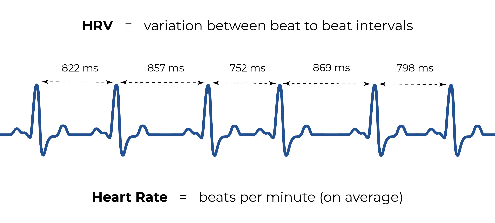

Useimmat uni- ja aktiivisuusmittarit seuraavat sykettä. Monet niistä raportoivat myös jotain nimelta "sykevaihtelu" eli HRV (heart rate variability). Mitä ihmettä se tarkoittaa, ja mitä HRV-lukemat kertovat sinulle? Mitä markkinointipuheen takana oikeasti piilee? Selvitetään!

## Mitä sykevaihtelu on?

Vaikka se saattaa kuulostaa oudolta, sydämesi ei lyö tasaisesti. Lyontien välillä on pienta vaihtelua rytmissa. Joskus lyöntien välinen aika on hieman lyhyempi, joskus pidempi. Puhutaan millisekunneista, joten et itse huomaa vaihtelua, mutta modernit sykemittarit huomaavat. Mittarisi HRV-lukema kuvastaa sydämenlyöntien valisen ajan keskimääräistä vaihtelua millisekunteina tietyn ajanjakson aikana (usein 5 minuuttia jatkuvissa HRV-mittauksissa).

Okei, mutta enta sitten? Sydamesi on elava elin, ei kone. Eiko ole ihan luonnollista, että rytmissä on jonkin verran vaihtelua? Asia on nimittain niin, että kyseessa ei ole satunnaista vaihtelua. HRV näyttää reagoivan autonomisen hermoston toiminnan muutoksiin.

## HRV on fysiologinen stressin mittari

Autonominen hermosto saatelee monia tiedostamattomia kehon toimintoja. Se voidaan jakaa kahteen haaraan: "taistele tai pakene" -järjestelmäan (sympaattinen hermosto) ja "lepaa ja sulata" -järjestelmäan (parasympaattinen hermosto). "Taistele tai pakene" -tila aktivoituu stressaavissa tilanteissa, jotka vaativat korkeaa vireystilaa. Tämän tilan aikana HRV laskee (eli lyöntien välinen vaihtelu vahenee). "Lepaa ja sulata" on vastakkainen tila. Se aktivoituu, kun ulkoisia stressitekijoita ei ole, erityisesti levon ja unen aikana. Tämän tilan aikana HRV nousee (vaihtelu lisaantyy).

Kaytannossa tämä tarkoittaa, että [HRV:ta voidaan käyttää fysiologisena stressin mittarina](http://doi.org/10.30773/pi.2017.08.17) ja toisaalta palautumisen mittarina. Matalat HRV-lukemat viittaavat korkeaan stressi- ja aktiivisuustasoon, kun taas korkeampi HRV on toivottavaa levon ja palautumisen aikana. Jos HRV-lukemasi ovat matalat myös levossa, on todennäköisesti jokin tekija, joka pitaa stressi- tai vireystasosi liian korkeana, eika palautumisesi ole optimaalista. Yleisesti ottaen yollisen HRV:n tulisi olla huomattavasti korkeampi kuin päivälla.

## Millainen on "hyva" HRV-arvo?

Perusperiaate on, että mitä korkeampi kokonais-HRV, sen parempi. On kuitenkin hyva muistaa, että HRV ei mittaa stressia suoraan. Se heijastaa koko autonomisen hermoston toimintaa, eivatka matalat HRV-lukemat välttämättä tarkoita, että olet stressaantunut. Monet muutkin tekijat voivat vaikuttaa HRV:hen.

Luonnollisesti vuorokaudenaika ja paivittaiset aktiviteetit vaikuttavat paljon. Liikunta, jannittavat toiminnot, voimakkaat tunteet, kiihtymys, kahvinjuonti, tyonteko... Kaikki nämä aktivoivat sympaattista "taistele tai pakene" -järjestelmäasi ja laskevat HRV:ta -- ja se on täysin normaalia! Vasta jos HRV-arvosi ovat jatkuvasti matalat, on syyta huoleen.

Mutta mikä on "matala" ja milloin arvot ovat optimaalisia? Se on paljon vaikeampi kysymys. HRV-arvot ovat yksilollisia, ja esimerkiksi ika, kuntotaso ja sukupuoli vaikuttavat niihin merkittavasti. Nuorilla ja hyvakuntoisten henkiloilla on yleensä korkeimmat HRV-arvot, kun taas ikaisemmilla ihmisillä matalammat lukemat ovat täysin luonnollisia. Siksi on jarkevanpaa verrata HRV-arvoja omiin aiempiin lukemiisi kuin muiden ihmisten arvoihin. Pida vain mielessasi, että yollisen HRV:n tulisi olla korkeampi kuin päivälla.

## Kannattaako HRV-mittauksiin luottaa?

HRV:n mittaaminen on huomattavasti monimutkaisempaa kuin tavallisen sykkeen mittaaminen ja vaatii mittarilaitteelta suurta tarkkuutta. Tarkkuuden kannalta sykevyot ja muut dedikoitut sykemittarit antavat parhaat tulokset. Monet puettavat laitteet, kuten rannekkeet, sormukset ja kellot, mittaavat myös HRV:ta, mutta ei ole aina helppoa arvioida, kuinka luotettavia lukemat ovat. ([Jotkut, kuten Oura, tarjoavat varsin vakuuttavaa nayttoa laitteidensa tarkkuudesta.](http://doi.org/10.1088/1361-6579/ab840a)) HRV on huipputeknologinen ratkaisu stressin ja palautumisen mittaamiseen. Luulen, että se on yksi syy siihen, miksi teknologiayritykset ja puettavien laitteiden valmistajat hehkuttavat sitä niin paljon!

Oletetaan, että useimmiten HRV-mittaukset ovat riittavan tarkkoja. Minulle tärkeämpi kysymys on, kuinka hyodyllisia nämä lukemat todella ovat levon ja palautumisen parantamisessa. Siihen ei ole yksinkertaista vastausta.

Kuvitellaan, että huomaat viime yon HRV:n olleen merkittavasti normaalia matalampi. Alat mietia, mistä se voisi johtua. Jos löydät uskottavan selityksen (tyostressi, alkoholinkäyttö, myohainen pelaaminen tai mikä tahansa) ja muutat sen jälkeen käyttäytymistasi, niin kyllä, tieto oli hyödyllistä. Mutta joskus HRV-arvojen ja todellisuuden valisen yhteyden hahmottaminen voi olla haastavaa. Jos et ymmarra, mitä lukema voisi tarkoittaa, se voi olla varsin hammentavaa eika lainkaan avuksi.

Kaiken kaikkiaan HRV ei todellakaan ole huijausta, mutta ei mitaan taikuuttakaan. Ajattelisin sitä edistyneena aktiivisuusmittauksen ominaisuutena. Siita voi olla hyötya ihmisille, jotka ovat kiinnostuneita itsen optimoinnista eivatka pelkaa käyttää Googlea (ja harjoittaa toisinaan kriittista ajattelua). Esimerkiksi urheilijat, joiden taytyy kiinnittaa erityista huomiota palautumiseensa, voivat kokea HRV-mittaukset erittain hyodyllisiksi. Mutta voit ehdottomasti elaa ilmankin ja silti levata aivan mainiosti!
