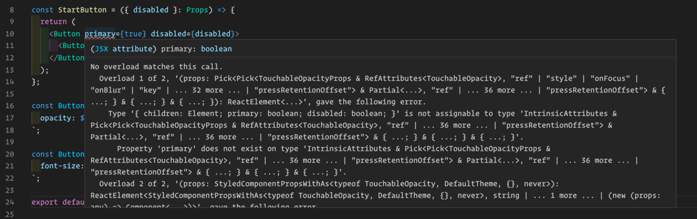

Using [styled-components](https://styled-components.com/) with React and React Native is great. Where it really shines in my opinion is when you use it with TypeScript and VS Code, getting code suggestions and errors when you write something wrong. In this article, we are going to take a look at how to use TypeScript with styled-components for better developer experience:

1. Styled-components with VS Code and types for styled-components
2. Theme variable suggestions using declaration merging
3. Type checking for component props

## Styled-components With VS Code

Before looking at TypeScript and styled-components I want to highlight a must-have plugin for VS Code: [vscode-styled-components](https://marketplace.visualstudio.com/items?itemName=jpoissonnier.vscode-styled-components). This plugin makes writing styled-components a lot better, with syntax highlighting, syntax error reporting, and IntelliSense.

## Installing the Types

Styled Components doesn’t come with types so we need to install them either running:

```bash
npm i --save-dev @types/styled-components
or
yarn add @types/styled-components --dev
```

## Theme Variable Suggestions Using Declaration Merging

Wouldn’t it be cool if you get type-checking for the themes you’ve created, as well as auto-complete for the theme variables? So that when you’re writing something like this:

```typescript
// The commonly seen way of accessing them
const TextOne = styled.Text`
  color: ${props => props.theme.primaryColor};
`

// Or by using object desctructuring for cleaner code
const TextSecond = styled.Text`
  color: ${({ theme }) => theme.primaryColor};
`
```

Then you wouldn’t have to remember if whether the primary color was written as `primaryColor` or `primary_color`. Instead, your editor tells you what theme variables stored inside the theme object you’ve created.

Well good news, you can easily achieve this by using the Typescript interface merging to override the default theme that comes with styled-components (more info how declaration merging works can be found [here](https://www.typescriptlang.org/docs/handbook/declaration-merging.html), and [here](https://styled-components.com/docs/api#create-a-declarations-file)). Here’s how to achieve that:

1. To access the theme in our app, we need to first setup ThemeProvider and the pass down our custom theme inside it.

```typescript
// App.tsx
import React from "react"
import { ThemeProvider } from "styled-components/native"
import Navigation from "/navigation"
import { lightTheme } from "/styles/theme"

const App = () => {
  return (
    <ThemeProvider theme={lightTheme}>
      <Navigation />
    </ThemeProvider>
  )
}

export default App
```

2. Then we create the theme file, import the original styled-components module declaration and extend it using **[declaration merging](https://www.typescriptlang.org/docs/handbook/declaration-merging.html)**. We add our own theme variables like primaryColor to the DefaultTheme and tell our theme objects to use that interface:

```typescript
// theme.ts
import { DefaultTheme } from "styled-components/native"

declare module "styled-components" {
  export interface DefaultTheme {
    primaryColor: string
    secondaryColor: string
  }
}

export const lightTheme: DefaultTheme = {
  primaryColor: "#333",
  secondaryColor: "#666",
}

export const darkTheme: DefaultTheme = {
  primaryColor: "#fff",
  secondaryColor: "#cacaca",
}
```

We could do this in separate styled-components.d.ts declaration file, but placing it inside the themes.ts file allows us to tweak the theme definition at the same when we add new variables.

With the declaration merging done using the theme variables suggestions in VS Code should look like this now:


## Type Checking for Custom Props

Another typical case with styled-components is using the props of the styled component to alter the styling, e.g. creating a button container that has the prop “disabled” and then using it as the conditional for reducing opacity like this:

```typescript
import React from "react"
import styled from "styled-components/native"

type Props = {
  disabled: boolean
}

const StartButton = ({ disabled }: Props) => {
  return (
    <Button disabled={disabled}>
      <ButtonText>Start counter</ButtonText>
    </Button>
  )
}

const Button = styled.TouchableOpacity`
  opacity: ${props => (props.disabled ? 0.5 : 1)};
`

const ButtonText = styled.Text`
  font-size: 17px;
`

export default StartButton
```

This works pretty well and when we type `props.something` VS Code should even show us an IntelliSense suggestion for the disabled prop, as long as we’ve installed the styled-components type definition. This is because those type definitions contain the type definition for `TouchableOpacity` with definition for a `disabled` prop. However, if were to define our own prop, something like `primary`, which would be of boolean value we would get a type error like below:



To fix this we need to add a new type for our button which contains the primary prop and then tell styled-components to use it:

```typescript
type ButtonProps = {
  primary: boolean
}

const Button = styled.TouchableOpacity<ButtonProps>`
  opacity: ${props => (props.primary ? 0.5 : 1)};
`
```

Now we should no longer get the error message unless we try to use the wrong value there. On top of that our we also get the autocomplete when using it to alter the styles:


