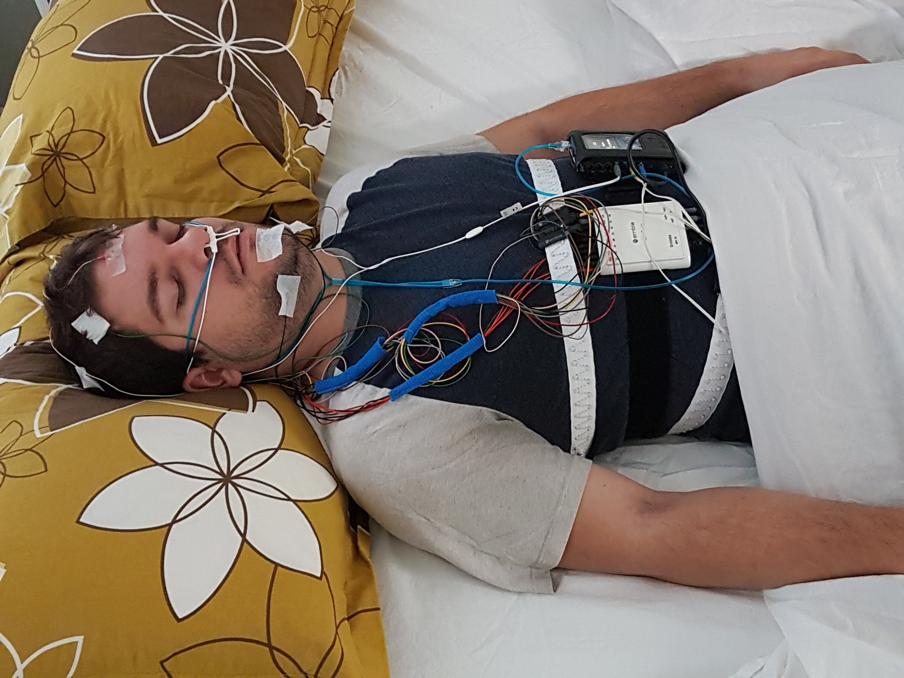
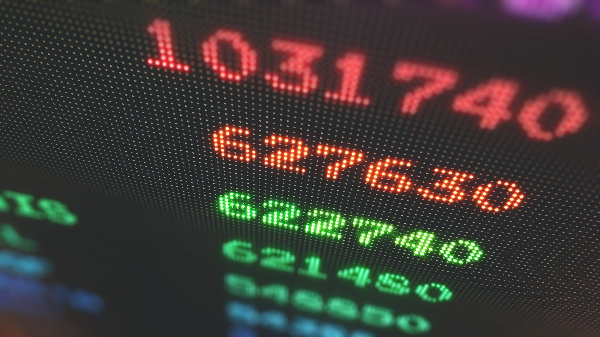

Puettava laite on ylivoimaisesti suosituin tapa seurata unta kotona. Käytännössä jokainen aktiivisuusmittari vuonna 2020, jopa halvimmat rannekkeet, pystyy seuraamaan untasi. Markkinoilla on niin valtava valikoima, että eri merkkien ja mallien vertailu voi olla työlästä ja aikaa vievää. Valmistajat piilottavat tekniset ominaisuudet hienolta kuulostavien muotisanojen ja markkinointifraasien taakse. Mitä mittari oikeastaan mittaa, ja kuinka suuri osa datasta on pelkkää arvailua? Mikä erottaa 29 euron laitteen 299 euron laitteesta? Tämä kaksiosainen opas auttaa sinua ymmärtämään, mihin kannattaa kiinnittää huomiota unimittaria ostaessa, mitkä ominaisuudet ovat vähemmän tärkeitä ja onko kalliimpi aina parempi.

Valitettavasti unimittarimarkkinat ovat harhaanjohtavan tiedon ja pseudotieteellisten väitteiden villiä länttä. Älä ymmärrä väärin! Mittarit voivat olla erittäin hyödyllisiä – sinun täytyy vain osata erottaa faktat fiktiosta. Ennen kaikkea on tärkeää ymmärtää, että **kuluttajille suunnatut unimittarit eivät mittaa unta suoraan**, vaan arvioivat sitä epäsuorasti käyttäytymisesi ja muiden välillisten tietojen perusteella. Siksi on ratkaisevan tärkeää tietää, mitä laitteet todella mittaavat ja mitä ne päättelevät datan pohjalta.

## Miten unimittarit toimivat?

Jokainen puettava kuluttajatason unimittari on pohjimmiltaan aktigrafilaite. Ne on varustettu aktiivisuusanturilla (kiihtyvyysanturi), joka seuraa kätesi liikkeitä päivällä ja läpi yön. Aktiivisuustason ja vuorokaudenajan perusteella laite arvioi, oletko ollut hereillä vai unessa.

Tällä tekniikalla on luonnollisesti rajoituksensa. Jos istut paikallasi lukemassa kirjaa tai katselemassa televisiota ennen nukkumaanmenoa, laite saattaa tulkita sen uneksi. Unen seuraaminen liikeanturia käyttämällä ei ehkä kuulosta kovin hienostuneelta tai vakuuttavalta, minkä vuoksi yritykset keskittävät myyntipuheensa usein lääketieteellisemmiltä kuulostaviin datalähteisiin, kuten sykkeeseen. Todellisuudessa liike on edelleen merkityksellisin ja eniten käytetty datanlähde kuluttajatason unimittareissa. Se voi tuottaa yllättävän tarkkoja arvioita uni-valverytmistäsi, etenkin yhdistettynä muihin datalähteisiin.

Jopa halvimmat unimittarit käyttävät aktigrafiaa unen yleisten piirteiden seuraamiseen. Jos perustekniikka on käytännössä sama, mikä sitten erottaa halvan ja kalliimman laitteen toisistaan? Datan osalta kaksi asiaa merkitsevät eniten: kuinka monta lisädatalähdettä käytetään liikeanturidatan rinnalla ja kuinka kehittynyt algoritmi on.

## Lisädatalähteet

Vaikka kehon liikkeet muodostavat unen mittaamisen ytimen, henkilökohtaiset unimittarit käyttävät usein muita datalähteitä kompensoidakseen puutteita ja tehdäkseen arvioista tarkempia (menetelmää kutsutaan triangulaatioksi). Käytettävät datalähteet vaihtelevat valmistajan mukaan. Tässä joitakin yleisimpiä.

#### Sydämen rytmi

Suurin osa puettavista unimittareista mittaa myös sykettä. Sykemallit voivat korreloida unen kanssa monin tavoin, ja niitä voidaan käyttää täydentävänä datalähteenä arvioitaessa unen kestoa ja laatua. ([Lue lisää sykkeestä ja unesta täältä!](https://nyxo.app/what-can-heart-rate-tell-about-your-sleep)) Jotkin kalliimmat laitteet mittaavat myös [sykevälivaihtelua (HRV)](https://nyxo.app/heart-rate-variability-hrv-is-the-hype-justified) ja jotkut jopa hengitystiheyttä (sydämen toiminnan perusteella). Syke- ja sydäntoimintamittaukset eivät yksinään tarjoa riittävästi tietoa unestasi, mutta ne voivat parantaa datan tarkkuutta ja niitä käytetään usein unen laadun arvioinnissa.

#### Kehon lämpötila

Kehon lämpötila laskee unen aikana, ja lämpötiladataa voidaan käyttää uni-valverytmien arvioimiseen laajemmalla tasolla. Tämä ei kuitenkaan ole yleisin ominaisuus, ja se löytyy tyypillisesti vain kalliimmista unimittareista.

#### Ympäristötekijät

Jotkut unimittarit mittaavat myös ympäristötekijöitä, kuten huoneenlämpötilaa, valoaltistusta tai ympäristön melutasoa. Älypuhelimen mikrofonin käyttäminen ympäristömelun mittaamiseen yöllä on tyypillistä erityisesti unenseurantasovelluksille, jotka eivät vaadi erillistä seurantalaitetta (pelkän ympäristömelun käyttäminen ainoana datalähteenä on luonnollisesti varsin rajoittavaa).

## Miten henkilökohtaiset unimittarit eroavat ammattilaitteista?

Ammattimaisen unen seurannan kultainen standardi on polysomnografia (PSG). Toisin kuin kuluttajamittarit, PSG perustuu ensisijaisesti aivojen sähköiseen toimintaan (EEG) eikä kehon liikkeisiin. Se seuraa myös useita muita kehon toimintoja, kuten sydämen rytmiä, silmien liikkeitä ja lihasten aktiivisuutta unen aikana. Puettavat unimittarit yrittävät jäljitellä joitakin näistä ominaisuuksista, mutta perusperiaate kuluttajatason ja lääketieteellisten unimittareiden välillä on täysin erilainen. Vaikka henkilökohtaiset unimittarit pystyvät arvioimaan perusteet, joitakin unen piirteitä ei voida mitata seuraamatta aivotoimintaa suoraan.

## Missä unimittarit ovat hyviä

Aktigrafiaan perustuvat unimittarit ovat parhaimmillaan havaitsemaan, oletko unessa vai hereillä, ja ne kehittyvät jatkuvasti. Ne pystyvät seuraamaan unen kestoa ja uni-valverytmejä, mikä tekee niistä erinomaisia työkaluja esimerkiksi [riittämättömän unen](https://nyxo.app/lesson/do-you-sleep-enough), [unen katkosten](https://nyxo.app/lesson/sleep-quality), vuorokausirytmin häiriöiden, [sosiaalisen aikaerorasituksen](https://nyxo.app/lesson/social-jet-lag) ja säännöllisyysongelmien havaitsemiseen.

## Missä unimittarit ovat huonoja

Henkilökohtaiset unimittarit eivät pysty tunnistamaan [unen vaiheita](https://nyxo.app/lesson/sleep-stages-explained). En voi korostaa tätä tarpeeksi. Yksikään nykyisistä aktigrafiaan perustuvista mittareista markkinoilla ei pysty luotettavasti kertomaan, oletko syvässä unessa, kevyessä unessa vai REM-univaiheessa. Kehon liikkeet (ja joskus syke) voivat muuttua hieman univaiheen mukaan, mutta korrelaatio on aivan liian epämääräinen ja epäjohdonmukainen hyödyllisten johtopäätösten tekemiseen ilman todellista aivotoimintadataa. Silti lähes jokainen unimittarivalmistaja väittää toisin. Univaiheiden seuraaminen rannekellolla ja unen laadun arvioiminen sen perusteella on puhtaasti huuhaata. Älä lankea siihen! Ehkä tulevaisuudessa kuluttajille suunnatut EEG-laitteet yleistyvät ja avaavat uusia mahdollisuuksia henkilökohtaisessa unen seurannassa, mutta toistaiseksi meidän on tyydyttävä siihen mitä on.

## Voitko luottaa "unitulokseesi"?

Unimittarit yrittävät yleensä mitata [unen laatua](https://nyxo.app/lesson/sleep-quality) tavalla tai toisella. Tyypillinen tapa on tarjota "unitulos" tai jokin muu mittari, jonka pitäisi kertoa, kuinka hyvin nukuit viime yönä. Se, kuinka luotettava unen laadun arvio on, riippuu yksinomaan siitä, miten se lasketaan ja mitä datalähteitä käytetään.

Jos tulos perustuu pääasiassa yöllisiin sykemalleihin, unen katkoihin ja nukkumaanmenoajan säännöllisyyteen, se voi tuottaa luotettavia arvioita unen laadusta. Jotkut laitteet kuitenkin nojaavat voimakkaasti univaiheisiin unen laadun arvioinnissa. Univaiheet vaikuttavat unen laatuun, mutta kuten jo totesimme, univaiheiden mittaaminen ilman aivodataa on parhaimmillaankin kyseenalaista. Tällaiset arviot eivät ole läheskään yhtä luotettavia, ja niihin vaikuttavat monet vääristymät ja häiriötekijät. Lyhyesti sanottuna: selvitä, miten unitulos lasketaan, ennen kuin luotat siihen sokeasti.

## Ovatko unimittarit hyödyllisiä?

Unimittarit voivat paljastaa paljon unestasi. Ne tarjoavat ainutlaatuisen ikkunan nukkumistottumuksiisi ja voivat aidosti auttaa sinua nukkumaan paremmin – kunhan osaat tulkita dataa. Muista kuitenkin, että pelkkä unen seuraaminen ei muuta mitään. Todellinen muutos lähtee sinusta itsestäsi.

## Miten valitset parhaan mittarin juuri sinulle?

[**Lue Unimittarin ostajan opas, osa 2!**](https://nyxo.app/unimittarin-ostajan-opas-osa-2)
