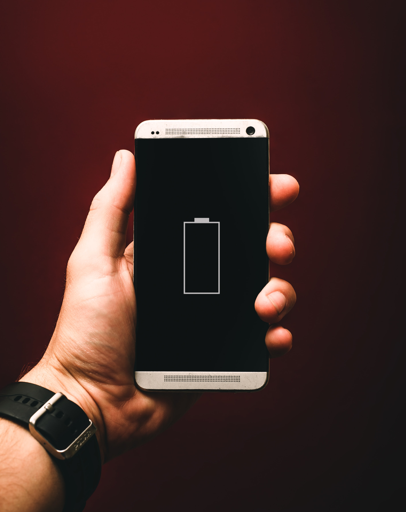

Jatketaan matkaamme unimittareiden maailmaan! Jos et ole vielä lukenut ensimmäistä osaa, [tee se nyt](https://nyxo.app/unimittarin-ostajan-opas-osa-1)!

Tässä vaiheessa sinulla on todennäköisesti jonkinlainen käsitys siitä, miten unimittarit toimivat ja mistä unidata koostuu. Mutta miten eri laitteet ja merkit eroavat toisistaan? Kannattaako panostaa huippumittariin, vai riittääkö halpakin? Millä perusteilla sinun tulisi tehdä valintasi?

## Unen tunnistamisen tarkkuus

Jokainen valmistaja käyttää omaa algoritmiaan yhdistääkseen dataa useista lähteistä mahdollisimman tarkkojen arvioiden saavuttamiseksi. Tarkkuudessa voi kuitenkin olla merkittäviä eroja. Hyvä unimittari tunnistaa mahdollisimman tarkasti, oletko unessa vai hereillä. Tämän pitäisi olla ensisijainen huomion kohteesi mittaria valitessa.

#### Painota datan laatua

Kiinnitä huomiota todellisiin datalähteisiin, joita laite käyttää unen seurantaan. Kuinka monta eri lähdettä on käytössä? Millaisilla antureilla laite on varustettu? Älä anna markkinointijargonin hämätä sinua. Mieti, mitkä datalähteistä ovat todella hyödyllisiä unen seurannassa ja mitkä ovat mukana vain siksi, että ne kuulostavat tieteellisiltä ja vakuuttavilta. Usein pelkät aktiivisuus- ja sykemittaukset riittävät tarjoamaan vankan perustan tavallisiin unen seurannan tarpeisiin. [Lue lisää unidatasta täältä](https://nyxo.app/unimittarin-ostajan-opas-osa-1).

#### "Edistyneet" unen seurannan ominaisuudet

Unen tunnistaminen on se, missä puettavat mittarit ovat parhaimmillaan. Usein yritykset mainostavat myös muita "edistyneempiä" ominaisuuksia, kuten univaiheanalyysiä sekä unen laatu- tai palautumispisteitä. Nämä ominaisuudet voivat tuoda mukavan lisän käyttäjäkokemukseen, mutta rehellisesti sanottuna osa niistä on melko temppuilua ja niillä on vähän todellista arvoa. Joissakin tapauksissa unen laadun seuranta saattaa olla riittävän tarkkaa (riippuu algoritmista). Toisaalta univaiheiden seuraaminen on selvästi kuluttajamittareiden kykyjen ulkopuolella, eikä siihen perustuvaa dataa tulisi koskaan ottaa liian vakavasti. Hereillä vai unessa on datan hyödyllisin osa, joten valitse ennen kaikkea mittari, joka tunnistaa unen tarkasti.

## Muut ominaisuudet

Uni on harvoin ainoa asia, jota puettavat aktiivisuusmittarit seuraavat. Suurin osa laitteista mittaa myös päiväsajan aktiivisuutta muodossa tai toisessa. Mieti, mitä lisäominaisuuksia tarvitset mittariltasi. Jotkut laitteet ovat kyvykkäämpiä urheilun ja kuntoilun seurannassa, kun taas toiset keskittyvät enemmän lepoon ja palautumiseen. Tarjolla voi olla myös laaja kirjo muita kuin seurantaan liittyviä ominaisuuksia. Tarvitsetko kattavat älykello-ominaisuudet ja integraation älypuhelimesi käyttöliittymään, vai oletko enemmän kiinnostunut itse seurannasta?

## Akun kesto

Tämä ei ehkä ole ensimmäinen asia, joka tulee mieleen, mutta unimittarimallien akun kestossa on yllättävän suuria eroja. Se voi vaihdella muutamasta päivästä useisiin viikkoihin. Usein ominaisuuksiltaan rikkaimmat älykellot kuluttavat eniten virtaa, ja minimaalisemmat laitteet vaativat vähemmän huoltoa. Mieti, kuinka usein olet valmis laittamaan laitteesi lataukseen. Markkinoiden uusimmasta ja hienoimmasta laitteesta ei ole hyötyä, jos sinulla ei ole energiaa pitää sitä ladattuna. Muista, ettet voi ladata sitä yön aikana, jos haluat seurata untasi!

## Yhteensopivuus

Yleisesti ottaen unen seuranta on mahdollista kaikilla nykyaikaisilla älypuhelimilla Bluetooth-yhteyden avulla. Vaikka useimmat suuret merkit ovat yhteensopivia sekä iOS- että Android-alustojen kanssa, on hyvä varmistaa, että valmistaja tukee käyttöjärjestelmääsi ennen mittarin ostamista. Kannattaa myös selvittää, kuinka joustavasti laite jakaa dataa kolmannen osapuolen sovellusten kanssa. Muuten olet jumissa valmistajan omien palveluiden kanssa. Nyxo toimii kaikkien unimittarimerkkien kanssa, kunhan ne ovat yhteensopivia Apple Healthin tai Google Fitin kanssa. Tuemme myös suoraan kokoelmaa suosituimmista merkeistä.

## Käyttömukavuus

Kun kyseessä on jotakin, jota pidetään päällä nukkuessa, käyttömukavuus on elintärkeää. Vaikka suuremmat älykellot saattavat olla pakattuja täyteen ominaisuuksia, kaikki eivät pidä massiivisen kellon pitämisestä ranteessa ympäri vuorokauden. Mukavuus voi olla ongelma erityisesti laitteissa, jotka mittaavat sykettä ranteesta. Jotta sykemittaus olisi tarkkaa, rannekkeen on oltava tiukemmalla kuin tavallista rannekelloa käytettäessä. Jos käytät laitetta päivin ja öin, tämä voi alkaa ärsyttää pitkän päälle.

Jos mahdollista, testaa laite ennen tilauksen tekemistä varmistaaksesi, että se tuntuu mukavalta. Tutki eri vaihtoehtoja ja löydä sinulle parhaiten sopiva. Vaikka rannekkeet ovat suosittuja, muitakin vaihtoehtoja on, kuten sormukset tai ei-puettavat patjan alle asetettavat seurantalaitteet.

## Hinta

Loppujen lopuksi tärkein kysymys on aina hinta. Kun hinnat vaihtelevat kolmestakymmenestä tai neljästäkymmenestä eurosta yli viiteensataan, on syytä kysyä, mitä lisäarvoa saat sijoittamalla enemmän rahaa unimittariin.

#### Muotoilu, hype ja lisäominaisuudet maksavat

Unimittareiden hintoja vertaillessasi sinun on tiedettävä, mitä oikeastaan vertailet. Jos etsit täysiverisiä älykelloa, sinun on varauduttava maksamaan hieman enemmän. Koska kyseessä on täysin eri laitekategoria, hinta ei ole suoraan verrattavissa halvempiin aktiivisuusmittareihin. Maksat lisäeuroja lisäominaisuuksista, et välttämättä paremmasta unen seurannan toiminnallisuudesta. On sinusta kiinni, pidätkö näitä ominaisuuksia hyödyllisinä vai et.

Kaunis muotoilu ja brändin vetovoima nostavat aina hintoja. Yleensä mitä kalliimpi laite on, sitä enemmän hinnassa on "ilmaa". Silti huippurahoja kalliista mittarista maksaminen ei välttämättä ole huono idea. Kalliit mittarit ovat yleensä varma valinta datan laadun ja tarkkuuden suhteen. Mutta jos budjetti on tiukalla, yhtä hyviä vaihtoehtoja voi löytyä myös edullisemmassa hintaluokassa, jos olet valmis käyttämään hieman aikaa tutkimiseen.

#### Ovatko halvat unimittarit hyviä?

Vaikka rahat olisivat tiukalla, voit silti saada melko hyvän unen seurantalaitteen. Älä valitse suoraan halvinta, vaan tee hieman taustatyötä. Lue tekniset tiedot ja käyttäjäarvostelut ja yritä löytää laite, joka tekee sen mitä lupaa ja tunnistaa unen mahdollisimman tarkasti. Et ehkä saa tyylikkäimmän näköistä tai mukavinta laitetta, ja siitä puuttuvat todennäköisesti viimeisimmät kikkakolmoset. Mutta unen parantamisen kannalta eroa 29 euron ja 299 euron laitteen välillä ei ehkä ole kovinkaan paljon. Jos sinulla on motivaatio muutokseen, mikään ei voita sitä!

